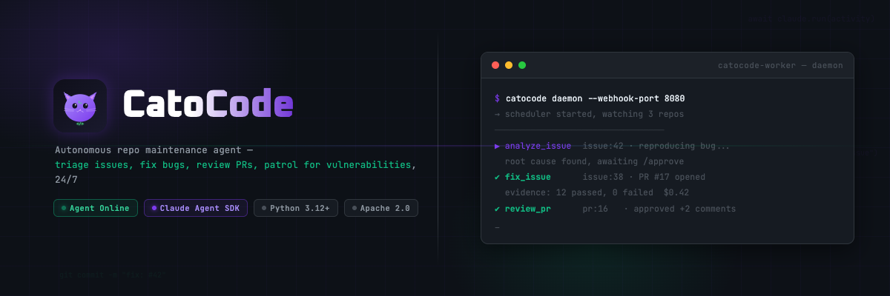

<div align="center">

<picture>
  
</picture>

<br />
<br />

[](https://github.com/humeo/cato-code/actions/workflows/ci.yml)
[](https://www.python.org/)
[](LICENSE)
[](https://www.docker.com/)

<br />

[Hosted Service](#-hosted-service) · [Quick Start](#-quick-start) · [See It Work](#-see-it-work) · [Design](#-design) · [How It Works](#-how-it-works) · [CLI](#-cli-reference) · [Contributing](#-contributing)

</div>

---

> [!IMPORTANT]
> **What CatoCode does:**
> - Runs Docker containers locally (isolated execution environment)
> - Calls the Anthropic API (code snippets are sent to Anthropic for analysis)
> - Posts comments and opens PRs on GitHub on your behalf
>
> **What it does NOT do:**
> - Does not send code to any third party other than Anthropic
> - Does not commit or merge code without your explicit `/approve`
>
> **To stop immediately:** `docker compose down`

---

## The Problem

Your GitHub repo generates new issues, PRs, and potential bugs every day.

Each bug follows the same loop: read the issue → pull locally → reproduce → locate the cause → write the fix → run tests → open a PR. Repetitive, time-consuming — and nothing happens while you're away.

AI code completion tools (Copilot, Cursor) help you write code, but they're reactive — they wait to be asked. Fully autonomous tools like Devin go the other extreme — you can't tell what changed or whether to trust the result.

**CatoCode sits in the middle: always running, actively responding, but leaving evidence at every step. You decide what to merge.**

> 你的代码库一直在产生 issue 和 bug——CatoCode 在你不在时帮你处理，但每一步都留证据，merge 权永远在你手里。

---

## Hosted Service

Don't want to self-host? Use the managed version:

**[www.catocode.com](https://www.catocode.com)** — Connect your GitHub repo, up and running in 5 minutes. No server configuration needed.

---

## Quick Start

```bash
git clone https://github.com/humeo/cato-code.git
cd cato-code
cp .env.example .env          # Add ANTHROPIC_API_KEY and GITHUB_TOKEN
docker compose up -d
docker compose exec catocode catocode watch https://github.com/owner/repo
```

Once running, CatoCode responds to new issues and PRs automatically. Full setup details in [Deployment](#-deployment).

---

## See It Work

Issue opens → CatoCode pulls the code, reproduces the bug, posts a comment → you reply `/approve` → CatoCode fixes it, runs tests, opens a PR.

```
# 1. Watch a repo (runs continuously from here on)
$ docker compose exec catocode catocode watch https://github.com/alice/myproject
✓ Watching https://github.com/alice/myproject

# 2. Someone opens an issue:
#    "Bug: calculate_average() crashes when list is empty"

# 3. CatoCode pulls the code, reproduces the bug, and comments on the issue:
#
#    Reproduced.
#
#    Root cause: calculate_average() doesn't handle empty lists → ZeroDivisionError
#    Repro:  python -c "from stats import calculate_average; calculate_average([])"
#    Output: ZeroDivisionError: division by zero
#
#    Proposed fix: add an empty-list guard at the top, return 0 or None.
#    Reply /approve to proceed.

# 4. You reply: /approve

# 5. CatoCode fixes, runs tests, opens a PR with a full evidence table:
#
#    ## Evidence
#    | Check            | Before                   | After        |
#    |------------------|--------------------------|--------------|
#    | Repro command    | ❌ ZeroDivisionError      | ✅ Returns 0  |
#    | Full test suite  | 11 passed, 1 failed      | 12 passed    |

$ docker compose exec catocode catocode status
done  88b7ce3b  fix_issue  issue:42  $0.68
```

You review a PR with full evidence attached. 30 seconds to verify — no local test run needed.

---

## Deployment

Docker Compose is the recommended approach — no local Python or uv required.

### 1. Configure

```bash
git clone https://github.com/humeo/cato-code.git
cd cato-code
cp .env.example .env
```

Edit `.env`:

| Variable | Required | Description |
|----------|----------|-------------|
| `ANTHROPIC_API_KEY` | ✅ | Anthropic API key |
| `GITHUB_TOKEN` | ✅ | GitHub PAT with `repo` scope |
| `PORT` | | Service port (default: `8000`) |
| `GIT_USER_NAME` | | Commit author name (default: `CatoCode`) |
| `GIT_USER_EMAIL` | | Commit author email (default: `catocode@bot.local`) |
| `MAX_CONCURRENT` | | Max concurrent tasks (default: `3`) |
| `CATOCODE_MEM` | | Worker container memory limit (default: `8g`) |
| `CATOCODE_CPUS` | | Worker container CPU limit (default: `4`) |

Full variable list: [`.env.example`](.env.example)

### 2. Start

```bash
docker compose up -d
```

First run builds Docker images (~5–10 min). Subsequent starts use the cache. The service runs continuously and processes events automatically.

### 3. Watch a Repo

```bash
docker compose exec catocode catocode watch https://github.com/owner/repo
```

Multiple repos are supported — each is managed independently.

### 4. Dashboard

The dashboard starts automatically with `docker compose up -d`. Open [http://localhost:3000](http://localhost:3000).

> To point at a remote backend, set `NEXT_PUBLIC_API_URL=http://your-server:8000` in `.env`, then run `docker compose up -d --build frontend`.

### 5. Webhooks (recommended)

Without webhooks, CatoCode uses scheduled patrol scans. Webhooks cut response latency from minutes to seconds.

```bash
# Create a public tunnel (macOS)
brew install cloudflare/cloudflare/cloudflared
cloudflared tunnel --url http://localhost:8000
```

In GitHub repo **Settings → Webhooks**, add:

- **URL**: `https://<tunnel-id>.trycloudflare.com/webhook/github/{owner-repo}`
- **Content type**: `application/json`
- **Events**: Issues, Issue comments, Pull requests, Pull request reviews

> `{owner-repo}` uses hyphen format, e.g. `alice-myproject`

---

## Design

**Best harness, best model.** CatoCode uses the Claude Agent SDK to drive Claude Code CLI inside a container with a full dev toolchain (git, gh, python, node, uv). The agent reads code, writes code, runs tests, commits, and opens PRs — the same workflow as a real developer, not a thin API wrapper.

**Security first, system-level isolation.** Every task runs in an isolated Docker container — resource-limited, no host filesystem access, destroyed after execution. Isolation is an architectural assumption, not a configuration option.

**Skills over features.** CatoCode has no feature flags — only Skills. Each capability is a standalone Markdown prompt template in `skills/`. Want to add a new capability? Write a `SKILL.md` — no Python changes required. The system scales by adding Skills, not by accumulating features.

**Proof of Work.** CatoCode doesn't accept "I fixed it." Every fix requires: failure evidence before + passing evidence after + full test suite with no regressions. The PR description contains a verifiable before/after table. You can decide in 30 seconds whether to merge.

> 设计哲学遵循 [nanoclaw](https://github.com/qwibitai/nanoclaw) 的设计哲学。

---

## How It Works

CatoCode runs continuously, listening for GitHub events and dispatching Claude agents in isolated containers.

```
┌─ Host Process ──────────────────────────────────────┐
│  Daemon                                              │
│  ├── Scheduler (approval check, patrol, dispatch)   │
│  ├── Webhook Server (/webhook/github/{repo_id})      │
│  └── Store (SQLite at /data/catocode.db)             │
└──────────────────┬──────────────────────────────────┘
                   │ Docker API
┌─ Worker Container ──────────────────────────────────┐
│  catocode-worker                                    │
│  ├── Claude Agent SDK + Claude Code CLI             │
│  ├── Dev tools (git, gh, python, node, uv)          │
│  └── /repos/{owner-repo}/ (cloned repos)            │
└─────────────────────────────────────────────────────┘
```

**Event flow:**

1. GitHub issue opens → webhook fires (or patrol scan triggers)
2. Decision engine classifies the event, selects a skill
3. Worker container pulls latest code, runs Claude Agent
4. Agent reproduces the issue, posts analysis comment, waits for `/approve`
5. `/approve` received → fix → run tests → open PR with Proof of Work evidence

<details>
<summary><b>Skills reference</b> — triggers and behavior for each skill</summary>

Skills are Markdown prompt templates in `src/catocode/container/skills/`. Edit them directly — no code changes needed.

| Skill | Trigger | Behavior |
|-------|---------|----------|
| `analyze_issue` | Issue opened | Pull code, reproduce, analyze root cause, post comment, wait for `/approve` |
| `fix_issue` | After `/approve` | Reproduce → fix → verify → open PR with Proof of Work table |
| `review_pr` | PR opened | Review code quality, security, test coverage, post review comments |
| `respond_review` | PR review comment | Address review feedback, push updates |
| `triage` | Issue opened | Classify and label, check for duplicates |
| `patrol` | Scheduled | Proactively scan the codebase for bugs and security issues (budget-limited) |

</details>

<details>
<summary><b>Proof of Work protocol</b> — why every fix is trustworthy</summary>

The `fix_issue` skill enforces a two-layer evidence protocol:

**Layer 1 — Reproduction evidence (required)**

Before fixing, prove the bug exists:

```bash
pytest tests/test_foo.py::test_bar 2>&1 | tee /tmp/evidence-before.txt
```

If the bug cannot be reproduced, no fix is attempted — a comment on the issue explains why.

**Layer 2 — Verification evidence (required)**

After fixing, verify with the same steps:

```bash
pytest tests/test_foo.py::test_bar 2>&1 | tee /tmp/evidence-after.txt
pytest 2>&1 | tee /tmp/test-suite-after.txt  # Full suite — confirm no regressions
```

The PR description includes a complete before/after comparison table. Verify in 30 seconds without running tests locally.

</details>

---

## CLI Reference

```bash
# Watch a repo (register and start continuous monitoring)
catocode watch https://github.com/owner/repo

# Stop watching
catocode unwatch https://github.com/owner/repo

# Fix an issue immediately (blocking, no webhook needed)
catocode fix https://github.com/owner/repo/issues/42

# View watched repos and recent activity
catocode status

# View activity logs
catocode logs <activity_id>
catocode logs <activity_id> --follow   # Stream in real time
```

> **With Docker Compose:** prefix commands with `docker compose exec catocode`.
> **Local development:** use `uv run catocode`.

---

## Development

```bash
uv sync --dev                              # Install dependencies
uv run pytest                             # Run tests
uv run pytest --cov=src/catocode         # With coverage
uv run pytest -m integration             # Integration tests (requires Docker)
uv run ruff check src/ --fix             # Lint
cd frontend && bun install && bun dev    # Frontend
```

---

## Contributing

1. Fork the repo
2. Create a feature branch: `git checkout -b feature/amazing-feature`
3. Add tests and verify: `uv run pytest`
4. Commit: `git commit -m "feat: add amazing feature"`
5. Open a PR

---

## License

Apache License 2.0 — see [LICENSE](LICENSE).

---

<div align="center">

[Hosted Service →](https://www.catocode.com) · [Quick Start](#-quick-start) · [CLI Reference](#-cli-reference) · [Contributing](#-contributing)

</div>
